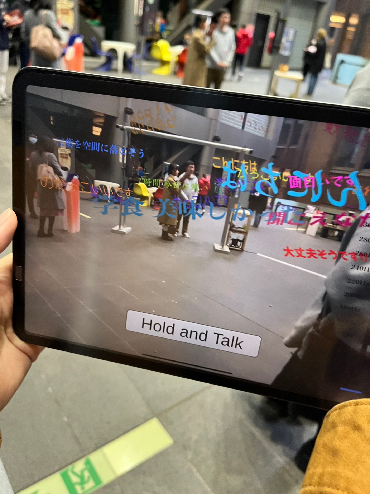

# seisakuten-otosu
We propose OTOSU (音す), a system that drops (落とす) words spoken into the AR space in real-time, as an initiative for deeper interaction between people and public spaces. 
This is an application makes spoken words appear as characters in AR space.
It was exhibited at "iii Exhibision 2023 学藝運動" at the University of Tokyo. https://www.iiiexhibition.com/

- The color of the letters changes with the height of your voice, the size of the letters changes with the volume of your voice, and the font of the letters changes with the speed of your voice.
- It is also possible to share the position of the letters with multiple devices.

